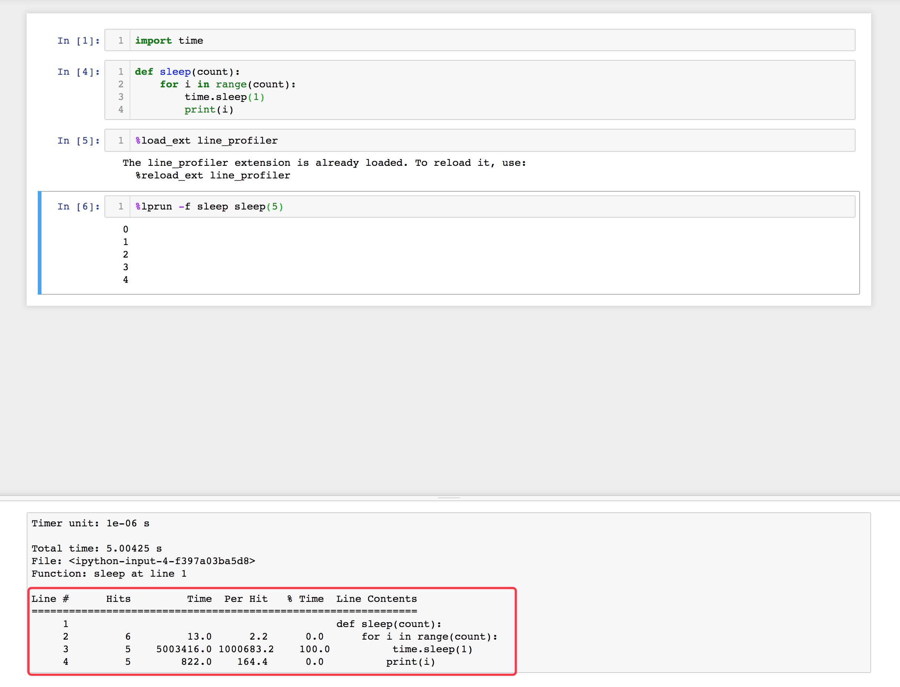

## Profiling

Firstly, install `line_profiler`.

`pip install line_profiler`

You can find more information about `line_profiler` in its [GitHub repo](!https://github.com/rkern/line_profiler).

Sencondly, run this command (which is called magic) in a Jupyter notebook cell:

`%load_ext line_profiler`

This line is used to "import" line_profiler

Thirdly, run this line to profile function **A** when running function **B**:

`%lprun -f A B(parameters)`

For example, if I have a function called `sleep` and it's defined as following:

```python
def sleep(count):
    for i in range(count):
        time.sleep(1)
        print(i)
```

Then if I want to profile this function, I just need to run `%lprun -f sleep sleep(5)`.

The full example are shown in this image:




## Show variables

In default mode, Jupyter will show the result of the last line if it's not be assigned to a variable.

To show all such results, you can add these two lines into the begining of your notebook.

```python
from IPython.core.interactiveshell import InteractiveShell
InteractiveShell.ast_node_interactivity = "all"
```

## Using Latex Math

You can only use Latex in *markdown cell*. Then things are the same with when using it in markdown. There are two ways to use it:

* independent mode: put your equationships into the middle of `$$$$` like `$$x^2+y^2=1$$`, then the output should be an equationship in a new line:

$$x^2+y^2=1$$

* inline mode: put your equationship into the middle of `$$` like `$x^2+y^2=1$`. Then the output should be \\(x^2+y^2=1\\). Notice it's inline mode

## No warning

Sometimes there may be some warnings and you decide just to ignore them. To make it looks better you could add these two lines into the begining of you code:

```python
import warnings
warnings.filterwarnings('ignore')
```

## Auto reformat

To reformat the code in Jupyter Notebook, you need two tools: [yapf](https://github.com/google/yapf) and [yapf_ext](https://github.com/jfbercher/yapf_ext).

Basically, what you need is just install them with the following commands.

```
pip install yapf
jupyter nbextension install https://github.com/jfbercher/yapf_ext/archive/master.zip --user
jupyter nbextension enable yapf_ext-master/yapf_ext
```
## Interactive plot

By saying interactive plot, we mean the tool provided by matplotlib which allows us to drag, zoom or ajust the figure we plot. To use it in Jupyter, you need to add and excute this **magic command** before you run the plot code:

```python
%matplotlib notebook
```

That's it! Enjoy the interactive plot now.

## Show data in table

Sometimes we may need to show the data in a table to make it vivid and clear for readers. Basically, there are two ways to do that.

1. Use a package named **tabulate**. It allows you to transform the two dimention list into a HTML table. And then call Jupyter's `display` function to show it.

Suppose our data is a two dimension list `data=[[1,2],[3,4],[5,6]]`. Then we can show it by `display(HTML(tabulate.tabulate(results, tablefmt='html')))`

2. Use the **dataframe** of the package **pandas**. Pandas is a famous package to handle table data. When we convert our data to pandas dataframe, we can just print it. Jupyter provides us with the proper way to show it.

So using pandas, wen can convert our data by:
```python
df = pd.DataFrame(data,columns=["X", "Y"])
```

## Draw for retina screen

Sometimes you may want to make the figure more clear in your retina screen. What you need to do is only add one line of magic code:
```python
%config InlineBackend.figure_format = 'retina'
```

## Keyboard Shortcuts

Shortcuts can accelerate our coding speed. Some basical shortcuts are shown in the following:

| Shortcut    | Meaning                                                      |
|-------------|--------------------------------------------------------------|
| Ctrl+Enter  | Execute this cell                                            |
| Enter       | Edit this cell, or called edit mode                          |
| Esc         | Back to command mode                                         |
| Shift+Enter | Execute this cell and move to next cell                      |
| b           | Insert cell below                                            |
| a           | Insert cell above                                            |
| j           | Move down                                                    |
| k           | Move up                                                      |
| c           | Copy this cell                                               |
| x           | Cut this cell                                                |
| v           | Paste cell below                                             |
| dd          | Delete cell. Note that this will not copy this cell like Vim |


---

[1]: https://adoni.github.io
